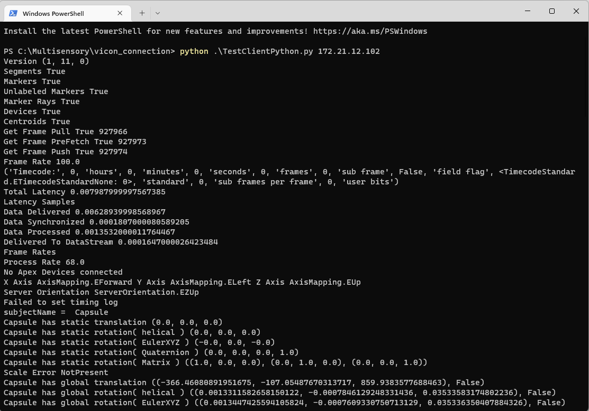

# vicon-oculus-unity
VR tracking system using Vicon Motion Capture and Oculus Quest 2

This is a project that tracks VR headsets and Physical objects by using Vicon motion capture cameras. Please read instructions below.

---

## Instructions

We begin by setting up each individual system used in the process, then combine them together in Unity and do coordinate calibration.

### Vicon in DGP

There are two groups of Vicon cameras in the lab (5192, 51xx). Both of them can be initialized using this procedure. The vicon camera system is connected to Desktop ViconPC in the lab (ViconMX3, ViconMX2, etc). Your goal is to connect your laptop/PC to the ViconPC via wifi network. The raw data is obtained by the ViconPC and sent to you through wifi. This is effective because the ViconPC only takes care of the tracking part, and you can do VR stuff on your own computer.

1. Sign in to ViconPC and open "vicon tracker" app. The necessary steps are: make sure all cameras are "ON"; use physical wand tool to do calibration; set the coordinate origin point (e.g. on the ground); create an object that represents the physical object you want to track and give it a name (e.g. let's say we name it "capsule"). For detailed instruction, read official [vicon tracker user guide](https://docs.vicon.com/download/attachments/133827160/Vicon%20Tracker%20User%20Guide.pdf?version=1&modificationDate=1601360389000&api=v2). 

    Keep the vicon tracker app running, we will need to obtain data remotely from this app later. Once the ViconPC is setup correctly, get the IP address of it.

2. Turn to your own laptop/pc. make sure you are in the "DGP" wifi or ethernet network (starts with 172.21). Ask John to register your mac address to the local network so that you can access ViconPC. 
    
    Follow the [official guide](https://docs.vicon.com/display/DSSDK111/Vicon+DataStream+SDK+Quick+Start+Guide+for+Python) to install Vicon DataStream SDK and Python Lib on your own laptop. Test the remote connection by running TestClientPython.py. If you can successfully get position data (shown in the picture below), that means your network connection is all good.

    

### Vicon+Unity

Since the connection between ViconPC and your laptop is built, now we can start to test Vicon+Unity app without VR yet. Download the official [Vicon Unity Plugin](https://www.vicon.com/software/third-party/unity/) and import it into your Unity project. follow the [guideline](https://docs.vicon.com/display/UnityPlugin13) to try out the "ViconSubjectScriptExample" scene. 

The basic idea of this unity plugin is: let's say you have an physical object called "capsule" in vicon tracker. The tracking data of "capsule" from viconPC transmits to the ViconDataStream Prefab in Unity. The SubjectScript will look for an virtual object with the same name "capsule" in the Unity scene and map the tracking data to this virtual object (translation and orientation).

What you need to do is: in the "ViconSubjectScriptExample" scene, fill the hostname and port for ViconDataStreamClient. Create an empty object A and create a cube/sphere/capsule as its child. Add the SubjectScript to A and fill subjectname. Name the cube/sphere/capsule "capsule".

Now if everything goes well, you will see the "capsule" moving in VR when you move the physical object in the real world! Congrats!

### Oculus+Unity

There is not much to introduce in this section, just follow the [official oculus guide](https://developer.oculus.com/documentation/unity/unity-gs-overview/). Alternatively, if you think it's too tedious, you can also follow [this link](https://alpercanberk.medium.com/how-to-make-a-unity-app-for-oculus-quest-2-part-1-project-setup-325e6b444575). It's a compressed guide with only necessary steps. If you have used your laptop for other kinds of VR development before, you might encounter some strange problems on the process. Just google them and most should be pretty easy to fix.

The expected result of this step is that: when you click "play" in Unity Editor, the test scene should be sent to your headset via Oculus Link and You can view the virtual scene in the headset. This means your Oculus is ready to use in Unity.

### Vicon+Oculus+Unity

Now it's the exciting and difficult part: combining both systems in Unity! The basic ideae is that we will replace the inside-out oculus tracking with vicon tracking, and let the vicon system to decide the translation and orientation of the headset. Therefore, we need to mount a grid of retroreflective balls to the headset, and another grid of balls on the object you aim to track. Create two objects in the vicon tracker representing the headset and the tracked object.

Finally, Run the vicon_test Unity project from this project! We use the SubjectScript for tracking both "capsule" and "hmdgrid". If you are using different names of these objects in Vicon tracker, just remember to change the configurations.

The biggest problem of combining Vicon and Oculus in Unity is that, Vicon and Unity use different coordinate system. Vicon Data uses a right-handed coordinate system, with +X forward, +Y left, and +Z up. Unity uses a left-handed coordinate system, with +X right, +Y up, and +Z forward. Therefore, conversion is needed for translation (XYZ) and orientation (Quaternion XYZW) to project the tracking position from Vicon to Unity. The current mapping strategy matches our setup in 5192. For new use case, you might need to try out and see what conversion is needed.

One useful link we found is [左右手坐标系的转换](https://blog.csdn.net/weixin_40277515/article/details/89323615) (written in Chinese).

We do feel that as HCI researcher, we lack knowledge to fully understand how the conversion works. Therefore, if have a better idea of how to do the coordinate conversion, feel free to add to this readme and make it better!

Update[June 2020]

Current Setup:

Marker on the headset: attach marker grid to the headset, rotate the grid so that in vicon tracker, y is facing backward and z is facing upward. Then add 90 degree to object rotation so y is facing upward and z is facing forward.

Marker on the object: adjust as you need.

Bingjian Huang,
Last Updated on June 20, 2022